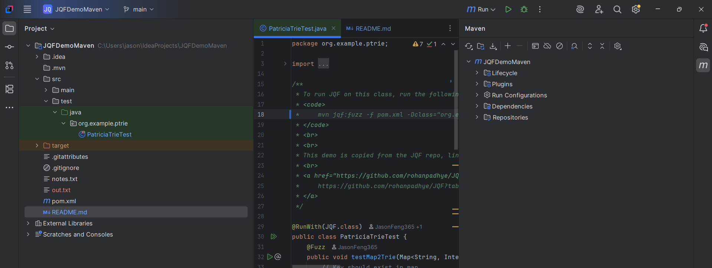
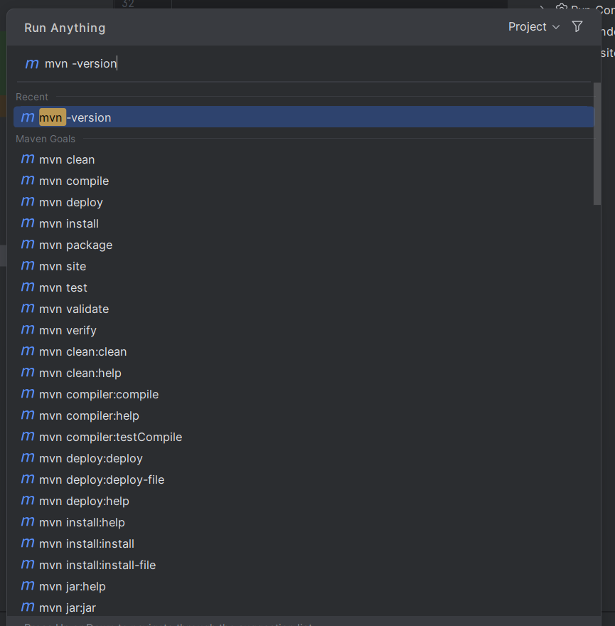

# JQF Demo with Maven

A demonstration project showcasing JQF + Zest.

This project implements a testcase that reveals potential issues in Apache Commons Collections' [PatriciaTrie](https://commons.apache.org/proper/commons-collections/apidocs/org/apache/commons/collections4/trie/PatriciaTrie.html)
implementation through fuzzing. JQF ([Github Link](https://github.com/rohanpadhye/JQF)) is used to automatically generate test
inputs that may expose bugs in the mapping between regular Maps and Tries.
   
Additional handwritten testcases are given as demonstrations of JQF.

**TODO: write some cool testcases!**

# Usage

Begin setting up Maven by running `mvn test-compile`. **This must be run whenever tests are changed or new tests are added**, or JQF may not detect them.

To run JQF on this class, run the following script in a project's root directory:
`mvn jqf:fuzz -Dclass=<path.to.ClassName> -Dmethod="<methodName>"`

For example, the [PatriciaTrieTest](src/test/java/org/example/ptrie/PatriciaTrieTest.java) test class may be fuzzed as follows:
`mvn jqf:fuzz -Dclass=org.example.ptrie.PatriciaTrieTest -Dmethod=testMap2Trie`

## Class Annotation

To enable JQF testing for a class, annotate it with `@RunWith(JQF.class)`:
```java
import edu.berkeley.cs.jqf.fuzz.JQF;

@RunWith(JQF.class)
public class PatriciaTrieTest { ... }
```

Each method with a JQF test must also be annotated with `@Fuzz`:
```java
import edu.berkeley.cs.jqf.fuzz.Fuzz;

@Fuzz
public void testMap2Trie(Map<String, Integer> map, String key) { ... }
```

# Installation

## Prerequisites
- IntelliJ IDEA IDE
- Maven buildtool
  - Maven is pre-packaged with IntelliJ.

This guide assumes `mvn` is available as a path variable. If it is not a path variable, follow these instructions to get the location of IntelliJ's Maven installation.

1. From the Maven menu on the right hand side, click on "Execute Maven Goal".

2. Run `mvn -version` to retrieve the version and path.

3. From the "Maven home" field in the output, append `bin/mvn` to the path. This is where the executable is located.
For example, on Windows:
```
Apache Maven 3.9.9 (8e8579a9e76f7d015ee5ec7bfcdc97d260186937)
Maven home: C:\Program Files\JetBrains\IntelliJ IDEA Community Edition 2025.2.1\plugins\maven\lib\maven3
Java version: 11.0.20.1, vendor: Amazon.com Inc., runtime: C:\Program Files\Amazon Corretto\jdk11.0.20_9
Default locale: en_US, platform encoding: Cp1252
OS name: "windows 11", version: "10.0", arch: "amd64", family: "windows"

Then, mvn command is located at:
C:\Program Files\JetBrains\IntelliJ IDEA Community Edition 2025.2.1\plugins\maven\lib\maven3\bin\mvn
```
4. Optional: You may choose to add the `bin` folder to the PATH environment variable for easier usage.

This full path may be substituted for the `mvn` command, if `mvn` is not in the PATH environment variable.
If the path has spaces, make sure to use quotation marks, so the spaces are taken into account.
This example shows execution of `mvn` using the full path on Windows:
`"C:\Program Files\JetBrains\IntelliJ IDEA Community Edition 2025.2.1\plugins\maven\lib\maven3\bin\mvn" jqf:fuzz -Dclass=org.example.ptrie.PatriciaTrieTest -Dmethod=testMap2Trie`

Note for Windows: Powershell may not like the double quotes. If Powershell doesn't work, try running it in Command Prompt.

## Installation

```
git clone https://github.com/JasonFeng365/JQFDemoMaven
cd JQFDemoMaven
```

# Sample Output

```
Semantic Fuzzing with Zest
--------------------------

Test name:            PatriciaTrieTest#testMap2Trie
Instrumentation:      Janala
Results directory:    C:\Users\jason\IdeaProjects\JQFDemoMaven\target\fuzz-results\PatriciaTrieTest\testMap2Trie
Elapsed time:         14s (no time limit)
Number of executions: 35,483 (no trial limit)
Valid inputs:         15,396 (43.39%)
Cycles completed:     6
Unique failures:      1
Queue size:           54 (9 favored last cycle)
Current parent input: 29 (favored) {579/860 mutations}
Execution speed:      3,108/sec now | 2,468/sec overall
Total coverage:       115 branches (0.18% of map)
Valid coverage:       115 branches (0.18% of map
```

A file will be generated in [target/fuzz-results](target/fuzz-results) with the class name, containing data about tests run and tests failed.

Each test method that we run generates two folders: `corpus/` and `failures/`.

The `corpus/` stores all interesting inputs that increased coverage of code base, while the `failures/` folder stores input that caused an assertion failure or uncaught exception.

It also generates files that store data involving coverage with `coverage_hash`, fuzzing metrics with `plot_data`, and console output with `fuzz.log`.

# Reading fuzz output files

The fuzzer saves outputs that fail within [target/fuzz-results](target/fuzz-results). These files are not in a human-readable format. Instead, the `Dinput` flag re-runs the program with the given inputs from the file:
`mvn jqf:repro -Dclass=<fully-qualified-class-name> -Dmethod=<method-name> -Dinput=<file-or-directory-name>`

For example, to view an input that fails that PatriciaTrie test:
`mvn jqf:repro -Dclass=org.example.ptrie.PatriciaTrieTest -Dmethod=testMap2Trie -Dinput=target/fuzz-results/org.example.ptrie.PatriciaTrieTest/testMap2Trie/failures/id_000000`

You may then 1) edit the original method to output the erroneous input or 2) define a new method to output the erroneous input. As an example, the [PatriciaTrieTest](src/test/java/org/example/ptrie/PatriciaTrieTest.java) class has a function to output raw and hex values of the maps' keys. 

# Troubleshooting

### I added a new test or changed a previous case, but the old output keeps appearing?
Run `mvn test-compile` to rebuild the project before trying to fuzz modified code.

Citations
https://rohan.padhye.org/files/jqf-issta19.pdf
https://github.com/rohanpadhye/JQF/wiki/JQF-Maven-Plugin